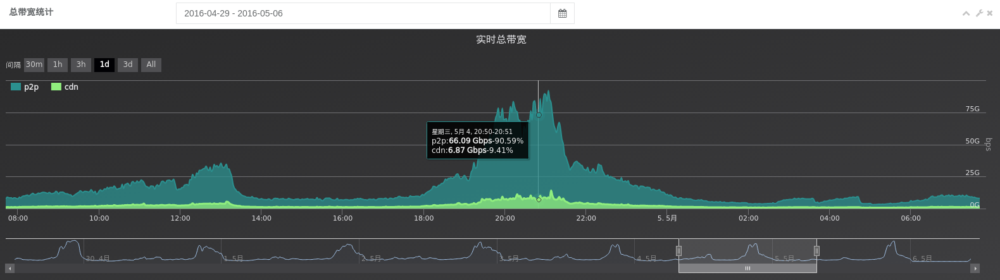

## P2P标准

maintainer：腾讯云

members：腾讯云，网宿，金山云

### 1.Introduction

腾讯云P2P方案支持全平台、多场景，具有良好开放性和兼容性，旨在帮助客户节约大量带宽成本。一个案例如下：  

此方案由腾讯云专业P2P团队研发，具备自主知识产权，在延迟、分享率、卡播率、系统资源占用率等多个参数进行持续优化，打造世界一流的P2P服务体系。方案遵循良好的软件工程原则，为融合P2P架构持续发展打下良好基础：

1. 系统兼容性：与现有CDN兼容且解耦和，支持FLASH、HTML5、IOS、ANDROID主流平台与系统；

2. 系统开放性：支持源站在第三方，后端也可对接多家第三方CDN；

3. 系统扩展性：兼容当前主流RTMP、UDP、HTTP-FLV直播协议，向后兼容MPEG-DASH直播协议，支持客户平滑迁移HTML5方案，未来有支持H265和微信小程序的计划；

### 2.模块标准

P2P方案流程要比CDN流程复杂很多，整体架构如下所示：

* 不依赖CDN，方便与各家CDN集成使用
* 确保用户体验不亚于CDN
* 输出格式统一且标准，兼容各家播放器
* 需要对rtmp或者http-flv直播流进行切片，对于HLS和Dash的天生切片形式的不用切片
* sdk必须自己实现统计用户使用了多少CDN，使用了多少P2P，然后上报给服务层统计P2P比率
* sdk必须提供精简的接口，或与播放器相同的接口，以方便快速地对接

### 3.SDK接口标准

方案针对FLASH、HTML5、IOS、ANDROID分别提供actionscript3、js、object-c和java接口标准。

##### 	3.1 FLASH平台

FLASH的SDK为swf，该swf可在网络上自由获取。SDK扩展自Adobe actionscript3的NetStream，支持符合NetSream全部原生方法。

详细请见[Flash文档](https://docs.qvb.qcloud.com/clients-sdk/flash/)

##### 	3.2 ANDROID和IOS平台

详细请见[Android文档](https://docs.qvb.qcloud.com/clients-sdk/android/)、[IOS文档](https://docs.qvb.qcloud.com/clients-sdk/ios/)

##### 	3.3 HTML5平台

详细请见[H5文档](https://docs.qvb.qcloud.com/clients-sdk/h5-hls/)
